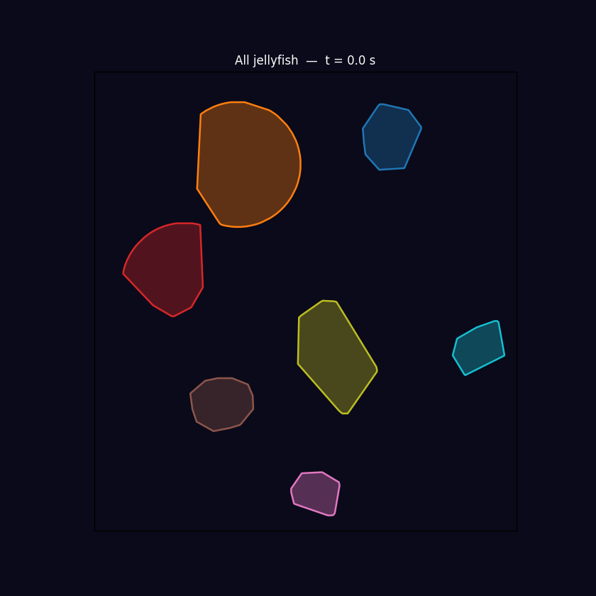
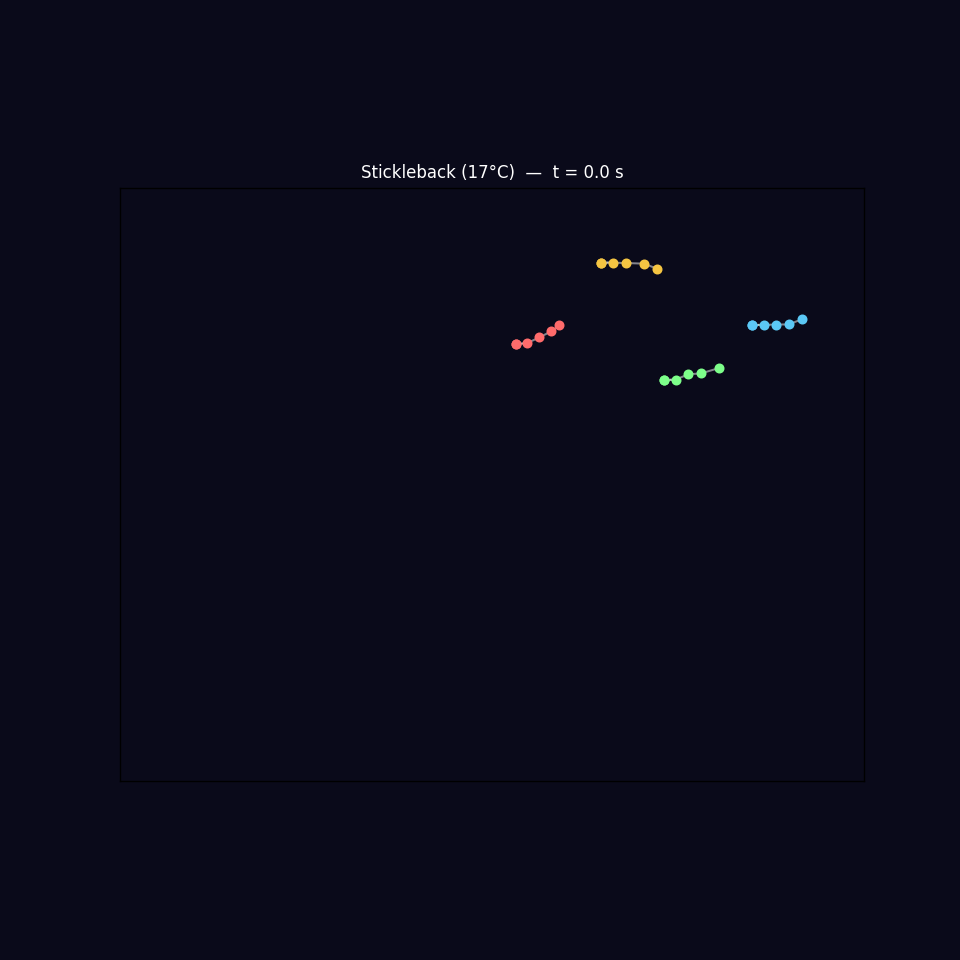

# ATLAS
### **A**nimal **T**rajectory **L**atent **A**lignment **S**pace

```
              .-"""""""""""""""-.
            .'  shared latent   '.
           /     z  z  z  z  z   \
          |    z   z   z   z   z  |
          |   z  A T L A S   z   |
          |    z   z   z   z   z  |
           \     z  z  z  z  z   /
            '.                 .'
              '-...........---'
                    | | |
                    | | |
                   _|_|_|_
                  /       \
                 / o     o \
                |     ^     |
                 \  \___/  /
                  \_______/
                  /|     |\
                 / |     | \
               _/  |     |  \_
         ~~~~^~~~~ >))°>  ~~~~^~~~~
         jellyfish  fish  jellyfish
```

> A community framework for mapping behavioral time series — keypoints, pose trajectories, or movement statistics — into a shared latent space across animals, subjects, and experimental conditions.

---

## Overview

Understanding behavior across individuals, species, and recording setups requires a common language. ATLAS provides that language by learning a shared latent representation of behavioral time series using a **β-VAE** framework with species-specific encoders and a shared latent bottleneck.

Each species gets its own Conv1d encoder and decoder — so each can learn the statistical structure of its own signal. What is shared is the latent space: both species are compressed into the same low-dimensional Gaussian, where position reflects behavioral similarity rather than recording differences. A shared **temperature regression head** (TempHead) provides supervised alignment pressure, biasing the latent space to organise along axes that are biologically meaningful across species.

```
species A windows          species B windows
       │                          │
       ▼                          ▼
 EncoderA (Conv1d)          EncoderB (Conv1d)
       │                          │
       └──────────┬───────────────┘
                  ▼
         shared latent z  (β-VAE)
                  │
       ┌──────────┴──────────┐
       ▼                     ▼
  DecoderA              DecoderB       TempHead (shared)
  (reconstruct A)   (reconstruct B)   (predict temperature)
```

See [`docs/model_architecture.md`](docs/model_architecture.md) for a full description of the architecture, training objective, and design rationale.

---



*Example: convex hull of a jellyfish body over time — the kind of behavioral time series ATLAS is designed to encode and align across individuals.*



*Example: stickleback fish swimming trajectory — pose and movement time series across individuals and conditions.*

---

## Motivation

Behavioral neuroscience faces a fundamental challenge: no two animals move in exactly the same way. Differences in body size, recording angle, and individual variation make it hard to directly compare neural or behavioral data across subjects. ATLAS is built to bridge this gap — learning the structure of behavior in a representation that generalizes.

This project is in active development and aims to grow into a community resource for anyone working at the intersection of **behavior, neuroscience, and machine learning**.

---

## Key Features

- **Species-specific encoders** — each species learns its own temporal feature detector; no forced common input representation
- **Shared latent bottleneck** — both species compressed into the same low-dimensional Gaussian; cross-species position reflects behavioral similarity
- **β-VAE regularisation** — KL annealing prevents posterior collapse; β controls disentanglement vs reconstruction trade-off
- **Supervised alignment via TempHead** — a shared regression head predicts temperature from the latent code, creating cross-species alignment pressure along biologically meaningful axes
- **Variable-length sequences** — `AdaptiveAvgPool1d` collapses any window length to the same feature dimensionality; jellyfish (60 s) and fish (5 s) windows use the same encoder architecture
- **Modular architecture** — swap in your own encoder, decoder, or loss components
- **Built on PyTorch** — familiar, extensible, and research-ready

---

## Installation

```bash
git clone https://github.com/depasquale-lab/ATLAS.git
cd ATLAS
pip install -e .
```

**Requirements:**
- Python >= 3.9
- PyTorch >= 2.0

---

## Quickstart

```python
import numpy as np
from atlas.model import BehavioralVAE
from atlas.train import train, encode_all

# Activity windows: (N, T, 1) — z-scored per species
species_a_windows = np.load("species_a_windows.npy")   # shape (N_a, T_a, 1)
species_b_windows = np.load("species_b_windows.npy")   # shape (N_b, T_b, 1)
temps_a = np.load("species_a_temps.npy")               # shape (N_a,), z-scored
temps_b = np.load("species_b_temps.npy")               # shape (N_b,)

# Initialize model — window lengths can differ across species
model = BehavioralVAE(latent_dim=8, jelly_seq=T_a, fish_seq=T_b)

# Train with interleaved mini-batches and KL annealing
history = train(model, species_a_windows, temps_a, species_b_windows, temps_b)

# Encode into the shared latent space
mu_a, temp_pred_a = encode_all(model, species_a_windows[:, :, 0], 'jellyfish')
mu_b, temp_pred_b = encode_all(model, species_b_windows[:, :, 0], 'fish')
```

See [`notebooks/atlas_demo.ipynb`](notebooks/atlas_demo.ipynb) for a walkthrough with synthetic data, or [`notebooks/atlas_training.ipynb`](notebooks/atlas_training.ipynb) for the full jellyfish × stickleback experiment.

---

## Data Format

ATLAS currently operates on 1-D activity signals — one scalar per time step per window:

```
(N, T, 1)
  │  │  └─ single activity channel (speed, hull-area rate-of-change, etc.)
  │  └──── time steps (can differ across species)
  └─────── windows / trials
```

Windows are z-scored **per species** before encoding, so signals on different absolute scales (e.g., px²/frame vs. px/ms) are made comparable without forcing a joint normalisation.

Support for multi-dimensional inputs (pose keypoints, skeletal trajectories) is on the roadmap.

---

## Example: jellyfish × stickleback

The first cross-species experiment encodes two phylogenetically distant animals tracked with completely different hardware:

| | Moon jellyfish (*Aurelia*) | 3-spine stickleback (28 dpf) |
|---|---|---|
| Tracking | MATLAB convex hull | SLEAP pose estimation |
| Frame rate | 30 FPS (binned to 1 FPS) | 121 FPS (binned to 1 FPS) |
| Activity signal | \|d(hull area)/dt\| (px²/frame) | Centroid speed (px/ms) |
| Window | 60 s | 5 s |
| Temperature | Ramps: 20→36°C, 20→40°C, 20→0°C, 20→50°C | Fixed: 17°C, 22.5°C |

Despite recording differences spanning orders of magnitude in timescale and signal units, the shared latent space organises both species along a common thermal axis: cold fish land near cold jellyfish, warm fish near warm jellyfish — with no explicit cross-species pairing during training.

---

## Roadmap

- [x] β-VAE core architecture with KL annealing
- [x] Cross-species alignment via shared TempHead
- [x] Variable-length sequences (AdaptiveAvgPool1d)
- [x] SLEAP and MATLAB hull data loaders
- [ ] Multi-dimensional inputs (pose keypoints)
- [ ] Pretrained model weights for common behavioral assays
- [ ] Integration with DeepLabCut / SLEAP output formats
- [ ] Visualization and analysis utilities
- [ ] Benchmarks and example datasets

---

## Contributing

ATLAS is a community project. Contributions of all kinds are welcome — new architectures, datasets, tutorials, bug reports, or ideas.

1. Fork the repo and create a feature branch
2. Make your changes with tests where applicable
3. Open a pull request with a clear description

---

## Citation

If you use ATLAS in your research, please cite this repository while a formal publication is in preparation:

```bibtex
@software{atlas2025,
  title  = {ATLAS: Aligned Time-series Latent Access Space},
  author = {DePasquale, Brian and Lovett-Barron, Matthew and Weissbourd, Brady},
  year   = {2025},
  url    = {https://github.com/depasquale-lab/ATLAS}
}
```

---

## License

MIT License — see [LICENSE](LICENSE) for details.

---


