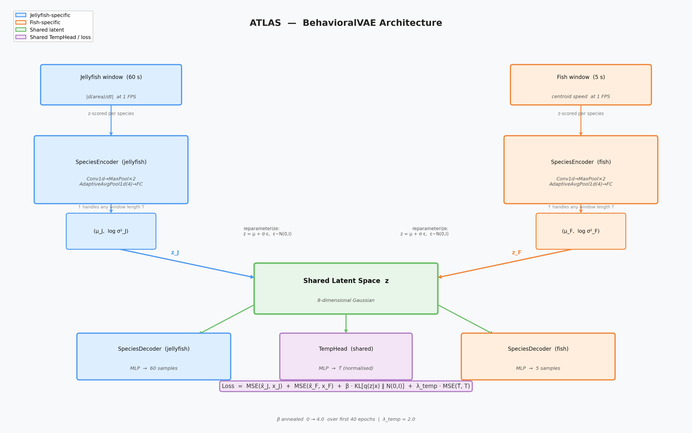

# ATLAS Model Architecture

## What problem is this solving?

Jellyfish and stickleback fish are phylogenetically distant, tracked with different hardware (MATLAB hull tracking vs. SLEAP pose estimation), recorded at different frame rates (30 vs. 121 Hz), and exhibit behavior on very different time scales (jellyfish pulsing over 60-second windows, fish swimming over 5-second windows). Their activity signals also live on completely different scales — hull-area rate-of-change in px²/frame vs. centroid speed in px/ms.

The goal is to ask: **do jellyfish and fish respond to temperature changes in a behaviorally similar way?** To answer that, we need a representation that is comparable across species — a shared latent space where the position of a jellyfish window and a fish window reflects their behavioral similarity, not their recording differences.

---

## High-level architecture



```
jellyfish window (60 samples)     fish window (5 samples)
         │                                 │
         ▼                                 ▼
  SpeciesEncoder_J               SpeciesEncoder_F
  (Conv1d, shared weights        (Conv1d, separate weights
   within species)                within species)
         │                                 │
         ▼                                 ▼
     (μ_J, σ_J)                       (μ_F, σ_F)
         │                                 │
         └──────────┬──────────────────────┘
                    ▼
            shared latent z  (8-D)
                    │
          ┌─────────┴─────────┐
          ▼                   ▼
   SpeciesDecoder_J    SpeciesDecoder_F     TempHead (shared)
   (reconstructs 60s   (reconstructs 5s    (predicts normalised
    jellyfish window)   fish window)         temperature from z)
```

Each species has its **own encoder and decoder** — this lets each encoder learn the statistical structure of its own signal without forcing a common feature representation at the input level. What is shared is the **latent bottleneck**: both species are compressed into the same 8-dimensional Gaussian, which is where the cross-species alignment happens.

---

## Components

### SpeciesEncoder

```
Input: (B, T, 1)  — one-channel speed/activity window, any length T
  → permute → (B, 1, T)
  → Conv1d(1→32, k=5) + ReLU
  → MaxPool1d(2)
  → Conv1d(32→64, k=3) + ReLU
  → MaxPool1d(2)
  → Conv1d(64→128, k=3) + ReLU
  → AdaptiveAvgPool1d(4)     ← collapses any T to exactly 4 time steps
  → Flatten → (B, 512)
  → Linear(512→128) + ReLU
  → Linear(128→2*latent_dim)  → split into (μ, log σ²)
```

The Conv1d layers act as learned temporal filters — they detect features like pulse onset, sustained activity, or rate change at multiple timescales. `AdaptiveAvgPool1d(4)` is the key trick that makes a single encoder architecture work for both a 60-sample jellyfish window and a 5-sample fish window: regardless of input length, the representation is always collapsed to 4 time steps before the FC layers.

### SpeciesDecoder

```
Input: z  (B, latent_dim)
  → Linear(latent_dim→128) + ReLU
  → Linear(128→seq_len)    ← seq_len=60 for jellyfish, 5 for fish
Output: reconstructed window (B, seq_len)
```

A simple MLP decoder. The decoder does not need to be complex — its job is to enforce that the latent code retains enough information to reconstruct the input signal, which keeps the encoder honest.

### TempHead

```
Input: z  (B, latent_dim)
  → Linear(latent_dim→32) + ReLU
  → Linear(32→1)
Output: predicted normalised temperature (B,)
```

A lightweight regression head that predicts the temperature label from the latent code. This is **shared across species** — it is the same set of weights whether z came from a jellyfish or a fish. This is the architectural component that encourages the shared latent space to organise along a temperature axis that is meaningful for both species.

---

## What is a β-VAE?

A **Variational Autoencoder (VAE)** is a generative model that learns to compress data into a low-dimensional probabilistic latent space and reconstruct it back. Unlike a standard autoencoder, which maps each input to a single point in latent space, a VAE maps each input to a **distribution** — specifically a Gaussian parameterised by a mean μ and variance σ². A sample z is drawn from that distribution and passed to the decoder. This stochasticity, combined with a regularisation term (KL divergence) that keeps the learned distributions close to a standard Gaussian prior, produces a latent space that is smooth and continuous: nearby points decode to similar outputs, and the space can be interpolated or sampled meaningfully.

A **β-VAE** is a straightforward extension: it multiplies the KL divergence term by a scalar β > 1, increasing the pressure on the encoder to produce posterior distributions that closely match the prior. The effect is a more **disentangled** latent space — individual latent dimensions tend to capture independent factors of variation in the data (e.g., one dimension for activity level, another for temporal pattern) rather than entangling them. The cost is slightly worse reconstruction, because the encoder is forced to use a more constrained code. The trade-off is controlled by β; here β = 4.0.

```
           Encoder                    Decoder
x  ──►  q(z|x) = N(μ,σ²)  ──►  z  ──►  x̂ ≈ x

Loss = MSE(x, x̂)  +  β · KL[ N(μ,σ²) || N(0,I) ]
         │                        │
   reconstruction            regularisation
   (keep signal)           (smooth latent space)
```

The KL term has an intuitive interpretation: it penalises the encoder for using latent codes that are far from zero or have very low variance (i.e., for "hiding" information in sharp, idiosyncratic codes). This forces the model to only use latent capacity for structure that is genuinely needed to reconstruct the data — anything that can be explained by the prior is discarded.

---

## Training objective

The total loss per mini-batch is:

```
L = L_ELBO_jellyfish + L_ELBO_fish + λ_temp * (L_temp_jellyfish + L_temp_fish)
```

where each ELBO is:

```
L_ELBO = MSE(x_recon, x) + β * KL(q(z|x) || p(z))
```

- **Reconstruction loss** (MSE): forces the latent code to preserve the input signal shape.
- **KL divergence**: regularises the latent space to be approximately standard Gaussian — producing a smooth, structured space that generalises across samples rather than memorising them. The β parameter (β = 4.0) controls the trade-off between reconstruction fidelity and latent space regularity; higher β produces more disentangled but less perfectly-reconstructing codes.
- **KL annealing**: β is linearly warmed up from 0 to 4.0 over the first 40 epochs. Starting with β = 0 lets the encoder first learn to reconstruct the signal; the KL penalty is then gradually introduced so the encoder doesn't collapse (posterior collapse is a common failure mode in VAEs when strong regularisation is applied from the start).
- **Temperature regression** (λ_temp = 2.0): an auxiliary supervised signal. By explicitly asking the latent code to predict temperature, we bias the shared space to organise activity along a biologically meaningful axis rather than, say, latent dimensions that capture recording artefacts.

Mini-batches are **interleaved**: one jellyfish batch and one fish batch are processed together at each gradient step, so both species contribute to every weight update.

---

## Why z-score per species?

Speed and hull-area-change are not in the same units and are not on the same scale. A naive joint normalisation would cause the jellyfish signal (with its larger absolute values) to dominate. Instead, each species' windows are z-scored independently, producing inputs with unit variance for both encoders. Temperature labels are also z-scored per species for the same reason — 17–22.5°C (fish range) and 20–38°C (jellyfish range) need a common scale before the shared TempHead can learn a meaningful cross-species temperature representation.

---

## Latent space structure (what the model learns)

After training, we encode all windows and project them to 2D with UMAP. The diagnostic plot has five panels:

1. **Jellyfish activity gradient** — jellyfish windows coloured by z-scored activity level, showing whether the latent space captures behavioral intensity.
2. **Thermal percentile alignment** — all windows (both species) coloured by within-species temperature percentile, revealing whether cold windows cluster together and warm windows cluster together across species.
3. **Jellyfish by experiment** — jellyfish windows coloured by experiment label, showing the contribution of each temperature ramp.
4. **Temperature prediction** — predicted vs. actual z-scored temperature from the shared TempHead, as a regression diagnostic.
5. **Fish by temperature group** — fish windows coloured by their two fixed temperatures (17°C and 22.5°C).

Key findings from the current cross-species experiment:

- **Temperature axis**: the latent space organises along a gradient that correlates with temperature across both species.
- **Sub-threshold crash**: the 20→36°C jellyfish experiment occupies a distinct high-activity region. These jellyfish reached an elevated but survivable temperature and remained active throughout — no crash. This cluster is spatially separate from the other three experiments (40°C crash, 0°C crash, 50°C cook), which all trend toward a low-activity region as animals reach their thermal limits.
- **Cross-species alignment**: in the thermal percentile panel, cold fish cluster near cold jellyfish and warm fish cluster near warm jellyfish — with no explicit cross-species pairing during training. 22.5°C fish partially overlap with the sub-crash jellyfish cluster; both populations are at elevated-but-tolerable temperatures with sustained high activity.

---

## Hyperparameters

| Parameter | Value | Rationale |
|-----------|-------|-----------|
| `latent_dim` | 8 | Small enough to force compression; large enough for multi-dimensional structure |
| `β` | 4.0 | Standard β-VAE value; promotes disentanglement |
| `N_ANNEAL` | 40 epochs | Prevents posterior collapse early in training |
| `λ_temp` | 2.0 | Weights temperature supervision relative to reconstruction |
| `JELLY_WINDOW` | 60 s | Covers a full pulsing cycle at 1 FPS |
| `FISH_WINDOW` | 5 s | Fish recordings are ~120 s; 5 s captures a bout of swimming |
| `JELLY_STRIDE` | 30 s | 50% overlap between windows |
| `FISH_STRIDE` | 2 s | 60% overlap between windows |
| `BATCH` | 64 | Standard; interleaved jellyfish + fish |
| `N_EPOCHS` | 250 | Empirically sufficient for loss convergence |
